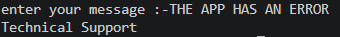
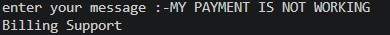

# AI Level 1 - Basic NLP Customer Message Classifier

## Objective 

The objective of this project is to classify customer messages into three categories:
Technical Support, Billing Support, and General Inquiry

## Approach/Algorithm 

1. Take the customer message as input.
2. Convert the message into individual words.
3. Split the message into individual words.
4. Remove punctuation from the words.
5. Remove common stop words.
6. Check the remaining words against technical and billing keywords.
7. Return the appropriate category:
   - Technical Support
   - Billing Support
   - General inquiry 

## Technologies Used 

- Python 
- Basic Natural Language Processing (NLP)
- String processing
- Lists and list comprehensions
- Conditional statements
- Functions

## How to Run 

1. Make sure Pyhton is installed.
2. Open the project folder in VS code or terminal.
3. Run the following command:

'''bash
python main.py

4. Enter a coustomer message when promted.
5. The program will classify the message into Technical Support,Billing Support, or General Inquiry

## Sample Outputs

### Technical Support

### Billing Support

### General Inquiry

## Conclusion

This project demonstrates a simple rule-based NLP approach for classifying customer messages using stop-word removal and keyword matching.
